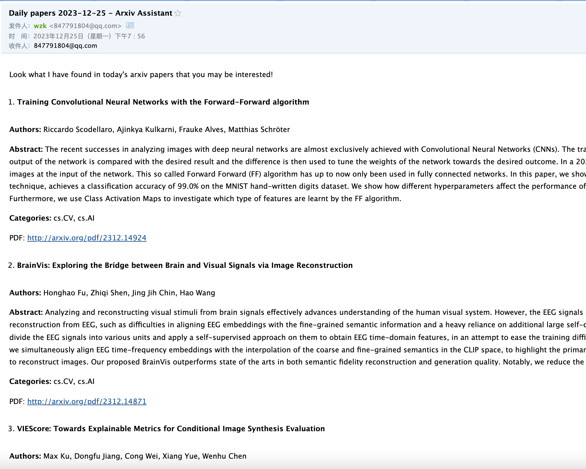

# Arxiv Assistant

Automatically fetch daily arxiv papers, filter with GPT, and send you an email.


The program will check for new papers every 6 hours, use GPT to filter papers related to your input keywords, and send an email to your email address. It also saves jsons under `papers/`.




## Quick Start

1. Save your OpenAI API key in `openai_key.txt`. If you don't want to use GPT filter or don't have an OpenAI API key, set `gpt_filter=False` when initializing `ArxivAssistant`.

2. Set up SMTP in your email ([Instructions](https://chat.openai.com/share/18e7b344-9f62-4c25-a75c-2bb822893c33)) and save the related information in `mail_info.json`. An example:

   ```json
   {
       "mail_host": "smtp.qq.com", // SMTP host
       "mail_user": "xxx@qq.com", // your email address
       "mail_pass": "xxxxxxxx" // e.g. identification code of SMTP
   }
   ```

3. Run the routine. Make sure the program runs constantly, e.g. run with tmux on a server

   ```python
   import openai
   import json
   
   from assistant import ArxivAssistant
   
   with open("openai_key.txt") as f:
       openai.api_key = f.read()
       
   with open("mail_info.json") as f:
       mail_info = json.load(f)
   
   assistant = ArxivAssistant(
       mail_host=mail_info["mail_host"],
       mail_user=mail_info["mail_user"],
       mail_pass=mail_info["mail_pass"],
       
       categories=['cs.CV', 'cs.CL', 'cs.LG', 'cs.AI'], # your interested arxiv categories. See https://arxiv.org/category_taxonomy 
       keywords=['large language model', 'LLM'], # keywords describing your research interest
       negative_keywords=['medical'] # (Optional) keywords describing papers you don't want to read
   )
   
   assistant.run_routine()
   ```


## Customize

1. Configure the number of papers: 

   1. `max_results_per_category`: If the number of papers in some category of one day exceeds this number, only the first `max_results_per_category` papers are kept. Defaults to 500.

   2. `max_papers_per_query`: The papers are divided into groups to avoid exceeding the context length of GPT, each containing this number of papers. Defaults to 50.

   3. `num_filtered_papers`: The maximum number of output papers for each group. Defaults to 10.

2. Configure routine interval: Set `routine_interval_hours`. Defaults to 6.

Note: Arxiv publishes new papers at [20:00 EST every Sunday to Thursday](https://info.arxiv.org/help/availability.html#announcement-schedule) When the interval is less than 24, the routine only succeeds one time a day. When the interval is more than 24, only the last publish date (yesterday / last Thursday) is considered.

3. Configure GPT: 
   1. `temperature`: output temperature. Defaults to 0.7.
   2. `gpt_model`: gpt model to use. Please note the context length, and change `max_papers_per_query` accordingly. Defaults to `gpt-3.5-turbo-16k`.

4. Change email receivers: `mail_receivers` is a list of receivers' email addresses. Defaults to the same as the mail sender.

5. Customize prompt for GPT and email content: Update the strings in `prompts.py` and `single_paper_info` in `assistant.py`. The email content follows Markdown format.


## Acknowledgment

This repository is partially built on [wbs2788/Arxiv-Daily](https://github.com/wbs2788/Arxiv-Dail).
